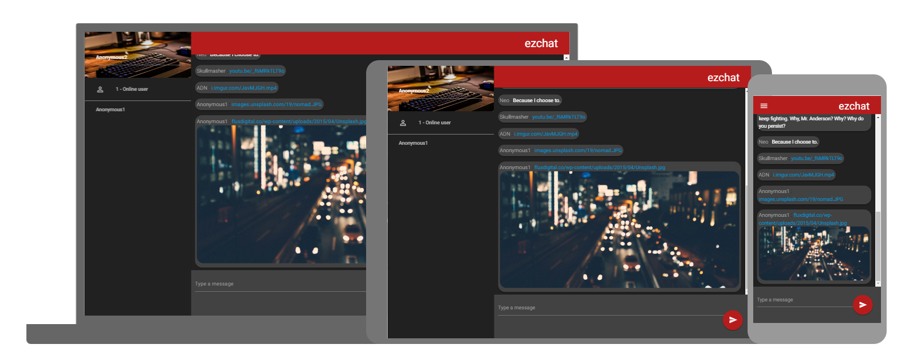

# ezChat

⚠️ Archived project, we might decide to go back to it if we want to try a new web framework or something.

<p align="center">
    
</p>


  

Where the Heartless talk shit, a simple chat for the heatless gamming community.

<p align="center">
    
</p>

This app is curently under developement and will be available under [heartlessgaming.com/ezChat](https://heartlessgaming/ezChat). 

## Start coding

Intall the project dependencie using a regular npm install.
```bash
$ npm i
```

Start a live reload server on [localhost:4200](http://localhost:4200) that listen to file changes of the front end **and** back end. (thanks [Parallelshell](https://github.com/keithamus/parallelshell))
```bash
$ npm start
```

Start coding with a simple `npm start` from there on out.

## Self Host

**Front :** Use `npm run build` to build the project for Production environement. A *dist* directory will be created containing the app code ready to be hosted on your web server.

**Back :** start the *server/index.js* file under a forever process. (Details will be added soon)

## Front
angular cli for project initialisation : https://github.com/angular/angular-cli  
Materializecss as css framework
Fonctionnalities :
- see who is connected
- see new messages
  - emoji interpretation
  - gif interpretation : done
  - youtube interpretation : done
- write a message : done
  - emoji selector
- notification in browser tab
- sound notifiaction ? (maybe borring will see)

### TODOs
- init project : done
- maquette with real component : done
- integration API : done

## Back :skull:
[](https://github.com/feross/standard)

The back office of ezChat is located in the **server** directory.

The purpose of the ezChat server is to handle events of the front-end users. eg : chat message received, user connected, user just left the chat.

Npm Script for back office developement
```bash
npm run devback
```
Restart de dev when change are made to the server directory (use [nodemon](https://github.com/remy/nodemon)).

Express : http://expressjs.com/
